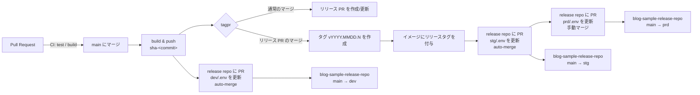

# blog-sample-app-repo1

ECS (Fargate) へのデプロイフローを解説するブログ記事のサンプルアプリケーションです。
「main へのマージで dev、[tagpr](https://github.com/Songmu/tagpr) がタグを切ったら stg (自動) と prd (手動マージ)」というリリースフローを実装しています。

このリポジトリは **アプリのコード、イメージのビルド、バージョニング** だけを担当します。
デプロイ定義とデプロイの実行は [blog-sample-release-repo](https://github.com/gainings/blog-sample-release-repo) にあります。このリポジトリの CI は、そこの定義ファイル内のイメージを書き換える PR を作ることでリリースを進めます。

## リリースフロー



1. **PR**: `ci.yml` がテストとイメージビルド (push なし) を行う。
2. **main にマージ**: `release.yml` が起動する。
   - イメージを 1 回だけビルドし、`sha-<commit sha>` タグで ECR に push する。
   - app と nginx サイドカーの 2 つのイメージをビルドする (どちらも同じタグ)。
   - リリースリポジトリの `dev/.env` を書き換える PR を作って auto-merge する。**dev** はこれで更新される。
   - `release.yml` が成功すると `tagpr.yml` が動く。通常のマージならリリース PR (バージョン更新 + CHANGELOG) を作成/更新して終わる。
3. **リリース PR をマージ**: `release.yml` → `tagpr.yml` が再び動き、tagpr が CalVer タグ (`v2026.0920.0` のような形式) と GitHub Release を作る。
4. **タグが push される** → `release-tag.yml` が動く。
   - 同じイメージ (app, nginx) へリリースタグを付与する。
   - リリースリポジトリに 2 つの PR を同時に作る。`stg/.env` をそのタグに書き換える PR は auto-merge し、**stg** はこれで更新される。`prd/.env` を書き換える PR は auto-merge しない。
5. **prd の PR をマージ**: これが本番リリース。リリースリポジトリ側で prd にデプロイされる。
6. **ロールバック**: リリースリポジトリで該当コミットを `git revert` した PR をマージする。

### 設計上のポイント

- **ビルド、バージョニング、タグ後処理の分離**: イメージのビルド (`release.yml`)、リリース PR とタグの管理 (`tagpr.yml`)、タグが切られた後の処理 (`release-tag.yml`) を別のワークフローにしている。`tagpr.yml` は `release.yml` の成功後にだけ動くので、ビルドの通っていないコミットにタグは付かない。`release-tag.yml` は `on: push: tags` なので、手でタグを push しても同じ経路でリリースできる。
- **複数イメージ (サイドカー)**: 1 つのタスクに app と nginx の 2 イメージがある。リリースリポジトリの `.env` には `IMAGE=` と `IMAGE_NGINX=` の 2 行があり、`set-image.sh` に 2 つのイメージを渡すと、それぞれ同じリポジトリを指す行だけが書き換わる。サイドカーが別リポジトリ由来なら、そちらの CI が自分のイメージだけを渡せばよい。
- **ビルドとデプロイの分離**: 全環境で同じイメージを使うので、「stg で確認したものが prd に出る」ことが保証される。
- **リポジトリの分離**: アプリ側は ECR への push 権限しか持たず、ECS への権限はリリースリポジトリ側にだけある。リリースリポジトリの main が「今リリースされているもの」で、履歴がそのままリリース履歴になる。
- **CalVer**: リリースは「いつ出したか」で識別する。tagpr の `calendarVersioning = YYYY.0M0D.MICRO` により `v2026.0920.0` のようなタグになり、同日 2 回目は `v2026.0920.1` になる。
- **GitHub App トークン**: `GITHUB_TOKEN` で作った PR には CI が走らず、`GITHUB_TOKEN` で push したタグは `on: push: tags` のワークフローを起動せず、他リポジトリに PR も作れない。そのため GitHub App のインストールトークンをワークフロー内で発行して使う。tagpr がこのトークンでタグを push するから `release-tag.yml` が起動する。
- **バージョンの埋め込み**: tagpr が更新する `VERSION` を `go:embed` でバイナリに含め、`/` で返す。どのバージョンが動いているかを HTTP で確認できる。

## ディレクトリ構成

```
.
├── main.go / main_test.go     # /health と / を持つ最小の HTTP サーバ
├── VERSION                    # tagpr が更新するバージョンファイル
├── Dockerfile                 # マルチステージビルド → distroless
├── nginx/                     # サイドカー (リバースプロキシ) のイメージ
├── .tagpr                     # tagpr 設定 (CalVer)
└── .github/workflows/
    ├── ci.yml                 # PR: test / build
    ├── release.yml            # main push: build → release repo へ dev の PR (auto-merge)
    ├── actions/release-pr/    # release repo に PR を作る共通処理 (auto-merge)
    ├── tagpr.yml              # release.yml 成功後: tagpr (リリース PR の作成/更新、マージ時にタグ作成)
    └── release-tag.yml        # タグ push: イメージにリリースタグ付与 → stg の PR (auto-merge) と prd の PR (手動)
```

## セットアップ

### 1. GitHub App

1. Organization または個人アカウントで GitHub App を作成する。権限は **Contents: Read and write**、**Pull requests: Read and write**。
2. このリポジトリと `blog-sample-release-repo` の両方にインストールする。
3. App ID を repository variable `GH_APP_ID` に、秘密鍵を secret `GH_APP_PRIVATE_KEY` に設定する。

### 2. Repository variables / secrets

| 種別 | 名前 | 例 |
|---|---|---|
| variable | `AWS_REGION` | `ap-northeast-1` |
| variable | `AWS_BUILD_ROLE_ARN` | `arn:aws:iam::111111111111:role/gha-blog-sample-app-build` (ECR push 用 OIDC ロール) |
| variable | `ECR_REGISTRY` | `111111111111.dkr.ecr.ap-northeast-1.amazonaws.com` |
| variable | `ECR_REPOSITORY` | `blog-sample-app` |
| variable | `GH_APP_ID` | `123456` |
| secret | `GH_APP_PRIVATE_KEY` | GitHub App の秘密鍵 (PEM) |

デプロイ先 (ECS) に関する設定はすべてリリースリポジトリ側の `blog-sample-app-repo1/{dev,stg,prd}/` (ディレクトリ名はこのリポジトリ名) にあります。

### 3. バージョンの決まり方

`.tagpr` で CalVer (`YYYY.0M0D.MICRO`) を有効にしているため、バージョンはリリース PR を作成/更新した日付から自動で決まります。同じ日に複数回リリースすると末尾の MICRO が `0`, `1`, `2` と増えます。CalVer モードでは `tagpr:major` / `tagpr:minor` ラベルは無視されます。

`VERSION` は初期値 `0.0.0` で、最初のリリース PR で tagpr が日付形式に書き換えます。

## ローカルでの動作確認

```sh
go test ./...
docker build -t blog-sample-app:local .
docker run --rm -p 8080:8080 -e APP_ENV=local blog-sample-app:local
curl localhost:8080/health   # => ok
curl localhost:8080/         # => {"env":"local","message":"...","version":"0.0.0"}
```
